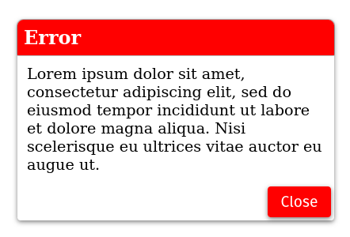
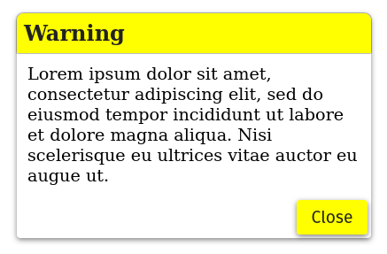
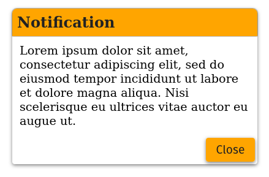
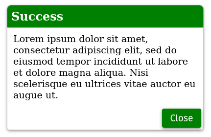

<h1>React Popup Component</h2>

The purpose of this project is to provide a simple popup notication using React components. To learn more about components see <a href="https://reactjs.org/docs/components-and-props.html">Components & Props - Reactjs.org</a>

There are two files that must be included for the component to function properly.
<ol>
<li>PopupComponent.js</li>
<li>popup.css/popup.min.css</li>
</ol>

Once the above files are included in the folder structure, import the component in each page or top level component where it is required.

<pre>
<code> 
import './popup.css';
import PopupComponent from './PopupComponent'; 
</code>
</pre>

Then initiate the component

 Error notification
<pre>
<code>
 &lt;PopupComponent
      title="Custom Error Message"
      body="Some error related text" 
      type="error"
    /&gt;
</code>
</pre>

 Warning notification
<pre>
<code>
 &lt;PopupComponent
      title="Custom Warning Message"
      body="Some warning related text" 
      type="warning"
    /&gt; 
</code>
</pre>

 Notification
<pre>
<code>
 &lt;PopupComponent
      title="Custom Notification Message"
      body="Some notification related text" 
      type="notification"
    /&gt;
</code>
</pre>

 Success notification
<pre>
<code>
 &lt;PopupComponent
      title="Custom Success Message"
      body="Some success related text" 
      type="success"
    /&gt;
</code>
</pre>

 <h2>Screenshots</h2>

